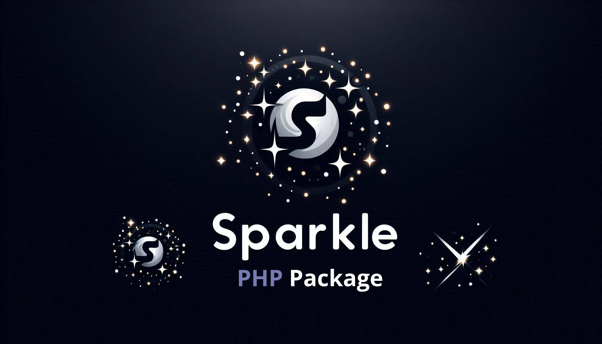

# Sparkle – A Lightweight Database Abstraction Layer for PHP  

**Sparkle** is a simple yet expressive **Database Abstraction Layer (DAL)** for PHP, highly inspired by Laravel's **Eloquent**. However, unlike Eloquent, which is a full-fledged **Object-Relational Mapper (ORM)**, Sparkle is a lightweight **query builder** designed for direct interaction with **PDO** while keeping things minimal and efficient.  

If you love **Eloquent's fluent syntax** but need something **lighter and more flexible**, Sparkle is the perfect fit.  

## Features  

✅ **Fluent Query Builder** – Write queries effortlessly using a clean and expressive syntax.  
✅ **Lightweight & Fast** – No heavy ORM, just raw performance with a structured API.  
✅ **Built on PDO** – Fully utilizes PHP’s native **PDO** for database interactions.  
✅ **Transactions Support** – Handle database transactions with ease.  
✅ **Error Handling & Logging** – Catch SQL errors and log them when needed.  
✅ **Raw Queries** – Run custom SQL queries with parameter binding.  
✅ **Flexible & Extensible** – Easily integrates into any PHP project.  

## Installation  

You can install Sparkle via Composer:  

```bash
composer require sirmerdas/sparkle
```

## Why Sparkle?  

While **Laravel Eloquent** is a powerful **ORM** with advanced features like model relationships, mutators, and events, **Sparkle** is a much simpler **DAL** that focuses only on **query building and execution**. It's perfect for projects where you don’t need the overhead of a full ORM but still want a structured and expressive way to interact with your database.  
